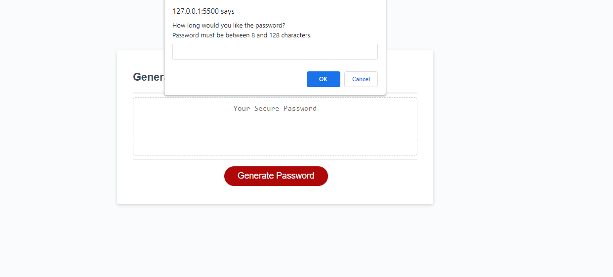

# password-generator 
    Generates passwords

# Reason for site
    The site is to help create a password for the user depending on the user imput and criteria (ex:) user can select between 8 and 128 characters and can choose characters of uppercase, lowercase, numbers or symbols.

# Website Mock-up

# I Learned...
    Showed me the basic breakdown of how JavaScript works. I learned about arrays, objects and how to call functions. Definitely need a lot more practice on it

# Challenges
    The whole project was very challenging. Understanding how to use the right syntax and when to call a function. I have completed the most I can with the knowledge available